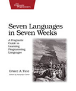

```
Roberto Nogueira  BSd EE, MSd CE
Solution Integrator Experienced - Certified by Ericsson
```

# Seven Languages in Seven Weeks



## Table of Contents

```
Contents

[ ] Dedication 
[ ] Acknowledgments 
[ ] Foreword 

1. Introduction 
[ ] 1.1 Method to the Madness 
[ ] 1.2 The Languages 
[ ] 1.3 Buy This Book 
[ ] 1.4 Don’t Buy This Book 
[ ] 1.5 A Final Charge 

2. Ruby 
[ ] 2.1 Quick History 
[ ] 2.2 Day 1: Finding a Nanny 
[ ] 2.3 Day 2: Floating Down from the Sky 
[ ] 2.4 Day 3: Serious Change 
[ ] 2.5 Wrapping Up Ruby 

3. Io 
[ ] 3.1 Introducing Io
[ ] 3.2 Day 1: Skipping School, Hanging Out 
[ ] 3.3 Day 2: The Sausage King 
[ ] 3.4 Day 3: The Parade and Other Strange Places 
[ ] 3.5 Wrapping Up Io 

4. Prolog 
[ ] 4.1 About Prolog
[ ] 4.2 Day 1: An Excellent Driver 
[ ] 4.3 Day 2: Fifteen Minutes to Wapner
[ ] 4.4 Day 3: Blowing Up Vegas 
[ ] 4.5 Wrapping Up Prolog 

5. Scala 
[ ] 5.1 About Scala 
[ ] 5.2 Day 1: The Castle on the Hill 
[ ] 5.4 Day 3: Cutting Through the Fluff 
[ ] 5.5 Wrapping Up Scala 

6. Erlang 
[ ] 6.1 Introducing Erlang 
[ ] 6.2 Day 1: Appearing Human
[ ] 6.3 Day 2: Changing Forms 
[ ] 6.4 Day 3: The Red Pill 
[ ] 6.5 Wrapping Up Erlang 

7. Clojure 
[ ] 7.1 Introducing Clojure
[ ] 7.2 Day 1: Training Luke
[ ] 7.3 Day 2: Yoda and the Force
[ ] 7.4 Day 3: An Eye for Evil
[ ] 7.5 Wrapping Up Clojure 

8. Haskell
[ ] 8.1 Introducing Haskell 
[ ] 8.2 Day 1: Logical
[ ] 8.3 Day 2: Spock’s Great Strength
[ ] 8.4 Day 3: The Mind Meld 
[ ] 8.5 Wrapping Up Haskell

9. Wrap-Up 
[ ] 9.1 Programming Models 
[ ] 9.2 Concurrency 
[ ] 9.3 Programming Constructs 
[ ] 9.4 Finding Your Voice 

A1. Bibliography 
Index 
```
